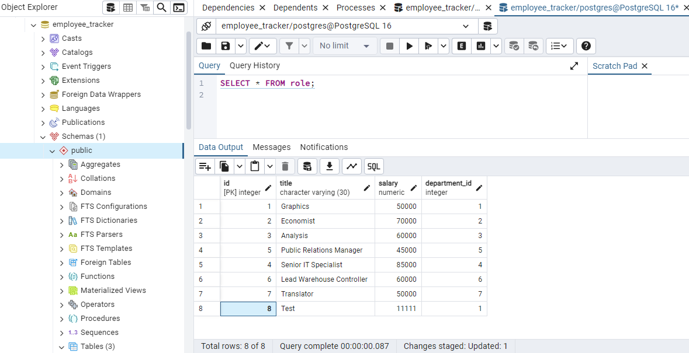

# SQLEmployeeTrackerCh12
A SQL based Employee Tracker program

# Table of Contents
- [Introduction and Usage](#introduction_and_usage)
- [Installation and How to use](#installation_and_how_to_use)
- [Links](#links)
- [Photos](#photos)
- [License](#license)
- [Credits](#credits)

# Introduction and Usage
A SQL employee database, using PostGreSQL for the database. enter 'npm start' to begin the Node console to allow editing and viewing of the Employee Database.

# Installation/How to use
- 1: Clone the repository to your pc or local machine.
- 2: Open the directory in the terminal.
- 3: Run using npm install to allow the correct dependencies to be added in order to run. and npm inquirer.
- 4: Connect your PostgreSQL database to the repository by entering the your own URL into the .env file
- 5: Run by entering npm start, in the terminal.
- 6: Proceed by filling out the prompted information to add new employee's, salaries, job titles etc to the database.

# Links
GitHub Repository.
https://github.com/ConnorLuks/SQLEmployeeTrackerCh12

Video of Use.
https://1drv.ms/v/c/0d7c60f6f050fa73/EbAoX--c_RVOg3_tM3MKx1wBBSQRqT8Yz7bKMa5kF2aYkQ?e=pT55aK

# Photos
Seeds for the Database

role PostGreSQL Data

employee PostGreSQL Data

department PostGreSQL Data

# License
Distributed under the MIT license.

# Credits
Connor O'Halloran.